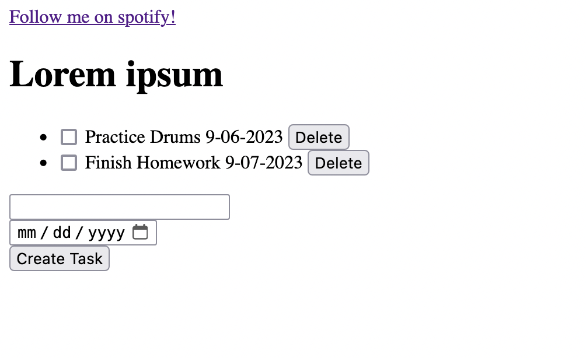

# IT210 Lab 1 Writeup
## Introduction
Ethan Asplund  
19 September 2023  
Lab 1
## Executive Summary
This lab sets up a styled tasklist website with a title, checkboxes, an assigned date, delete buttons, and a task creation option. The skeleton of the website is created with HTML which is then styled with CSS. Afterwards the website is hosted on an Apache2 server.

## Design Overview

The first part of the lab solely focuses on the creation of the HTML for the webpage. It entails these list of things:
- Navigation bar
- Page Title
- Unordered of list of tasks
- Checkboxes
- Assigned date
- Delete button
- Task creation form  

 
*End result of the HTML page* 

The second part of the lab stylizes the HTML using CSS to make it look better. A small amount of Javascript is added to extract form data for task creation.

--Completed website--
*Changes Include:*  
1. "Sort by date" and "Filter completed tasks" button are added.
2. Checkboxes crossout tasks when enabled. 
3. Icons are added for the checkbox and delete buttons
4. Navigation bar and all buttons are colored 
5. Background image is added
6. Page is completely restructured

### *File Descriptions*
- src/index.html - Creates the skeleton for the tasklist
- src/css/style.css - Stylizes the page, adds icons for the checkbox and delete buttons
- src/js/script.js - Extracts form data when a user clicks create task.

## Questions

1. What is the purpose of using Docker containers?

Websites have a lot of dependecies that are needed to run correctly. A docker conatins everything and hosts it in an isolated environment.

2. Why is it useful to have both a development environment and a live server environment?

Code breaks *all the time.* It's extremely important to isolate a development branch from the live server host to ensure the website functions as intended before redeploying.

3. What is the purpose of using a code versioning tool (i.e. Git)?

It's useful because it allows for version control. Every change you make to the code is tracked so you can easily roll back or analyze prior code when a bug occurs.

4. What is the difference between a CSS rule with an element selector (i.e. h1,p,div etc.) and one with a class selector (i.e. .task, .task-done etc.)? When would you use each?

Element selectors will call every single element in the scope. It gets convoluted quickly, because trying to select very specific element like a p or a div will cause you to select every single instance of it. It's useful if you want to change every single instance of that element in the scope. Classes can allow you to be far more specific

5. What are the advantages of putting your styles in a separate css stylesheet instead of in the style element of head 

It's far better for organization. You can allow the HTML document to focus exclusively on building the skeleton and the stylesheet for the styling. Separate stylesheets are also far more reusable as templates. For instance, if you have a navbar on one of your pages, you can reuse it on the next. 

6. How do web browsers choose which CSS to use for an HTML element when the CSS rules contradict each other? What is the order of precedence for CSS rules?

The order of precedence for CSS is Inline Styles > IDs > Classes > Attributes > Elements. If a class and ID conflict, the ID will be taken. If an element is selected in two different calls, the one which is mentioned last will take precedence. If there's elements nested within the one you're calling, all elements inside the nest will be impacted.

7. Why should you disable directory access for your server?

It's primarily for security. If you don't disable this you leave your application open to directory-traversal exploits. A simple "../" added to a web link could reveal all the files being hosted through the server, thus potentially revealing sensitive data.

## Lessons Learned

1. **.task-done:checked{
    text-decoration: line-through;
}**

In this snippet, I tried to make it so when the checkbox was checked, it would cross out the text layed out in the task. But instead it was just crossing out the checkbox
I fixed this issue by revising it to do this instead.   

**.task-done:checked + .task-description {
  text-decoration: line-through;
}**    
This selector makes it so when the task-done attribute "checked" is true, it specifically crosses out the task-description class.

2. **Javascript isn't working on the document**  
This issue was primarily due to me misreading instructions. I forgot to link the Javascript file to the document. My solution was to simply link my HTML file to my javascript file using the style tag.

3. Button icons aren't showing.

## Conclusions

